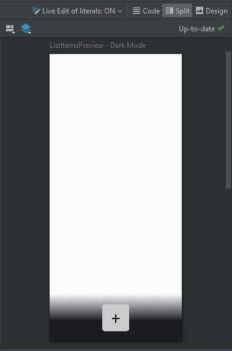

# Jetpack Compose
## Основы
Jetpack Compose представляет современный инструмент от компании Google для создания приложений под ОС Android на языке программирования Kotlin. Jetpack Compose упрощает написание и обновление визуального интерфейса приложения, предоставляя декларативный подход.


При создании проекта, который использует Jetpack Compose, в Android Studio, в проект по умолчанию добавляется файл MainActivity.kt, который содержит одноименный класс <code>MainActivity</code>. Этот класс определяет интерфейс, который будет виден при запуске проекта. 

```kotlin
class MainActivity : ComponentActivity() {
    ...
    override fun onCreate(savedInstanceState: Bundle?) {
        super.onCreate(savedInstanceState)
        setContent {
            AndroidODataOfflineSampleTheme {
                // A surface container using the 'background' color from the theme
                Surface(
                    modifier = Modifier.fillMaxSize(),
                    color = MaterialTheme.colorScheme.background
                ) {
                    MainScreen()
                }
            }
        }
    }
    ...
}
```

MainActivity наследуется от встроенного класса <code>ComponentActivity</code>. <code>ComponentActivity</code> обеспечивает построение интерфейса из визуальных компонентов. <code>ComponentActivity</code> предоставляет метод <code>onCreate()</code>, который вызывается при запуске приложения и создает интерфейс этого приложения.

В метод передается объект <code>Bundle</code>, который хранит состояние MainActivity - некоторые значения, хранят связанные с <code>MainActivity</code> данные. А в самом методе <code>onCreate()</code> вначале вызывается реализация этого метода из базового класса <code>ComponentActivity</code>.

За создание интерфейса в <code>onCreate()</code> отвечает метод <code>setContent()</code> - унаследованный от <code>ComponentActivity</code>, определяет отображаемый интерфейс. В этот метод передается визуальный компонент - функция с аннотацией <code>@Composable</code>.


```kotlin
@Composable
fun AndroidODataOfflineSampleTheme(
        darkTheme: Boolean = isSystemInDarkTheme(),
        // Dynamic color is available on Android 12+
        dynamicColor: Boolean = false,
        content: @Composable () -> Unit
) {
    ...
}
```

<code>AndroidODataOfflineSampleTheme</code> - задает визуальный интерфейс, также обеспечивает соответствие приложения текущей теме (светлой или темной) устройства. Начиная с 12 версии ОС Android, могут использоваться меняющиеся темы, чтобы отключить привязку к оформлению меняющихся тем, необходимо задать значение <code>dynamicColor</code> равное <code>false</code>, тогда будет использоваться тема приложения (оформление из каталога ui.theme). Изначально значение <code>dynamicColor</code> по умолчанию равно <code>true</code>.

В каталоге ui.theme предопределены настройки визуального отображения компонентов графического интерфейса:
- Color.kt - содержит предопределённый набор цветов элементов интерфейса
- Theme.kt - содержит общие настройки темы
- Type.kt - содержит набор текстовых стилей


## Компоненты
### Контейнеры компоновки

**[Box](https://developer.android.com/reference/kotlin/androidx/compose/foundation/layout/package-summary#Box(androidx.compose.ui.Modifier))** - является наиболее простым контейнером, позволяя позиционировать вложенное содержимое. Дочерние элементы накладываются друг на друга.

**[Column](https://developer.android.com/reference/kotlin/androidx/compose/foundation/layout/package-summary#Column(androidx.compose.ui.Modifier,androidx.compose.foundation.layout.Arrangement.Vertical,androidx.compose.ui.Alignment.Horizontal,kotlin.Function1))** - позволяет выстроить вложенные компоненты в столбик. 

**[Row](https://developer.android.com/reference/kotlin/androidx/compose/foundation/layout/package-summary#Row(androidx.compose.ui.Modifier,androidx.compose.foundation.layout.Arrangement.Horizontal,androidx.compose.ui.Alignment.Vertical,kotlin.Function1))** - располагает вложенные компоненты в строку.

По умолчанию, контейнеры компоновки занимают те размеры на экране, которые необходимы, чтобы вместить содержимое. Стоит учитывать, что если контейнер обеспечивает горизонтальную прокрутку или располагается в контейере, который предполагает горизонтальную прокрутку, то модификатор веса компоненты игнорируется, поскольку общее пространство по горизонтали условно бесконечно. 

Подробнее про Box, Column, Row можно посмотреть [тут](https://developer.android.com/jetpack/compose/layouts/basics).

**[LazyColumn](https://developer.android.com/reference/kotlin/androidx/compose/foundation/lazy/package-summary#LazyColumn(androidx.compose.ui.Modifier,androidx.compose.foundation.lazy.LazyListState,androidx.compose.foundation.layout.PaddingValues,kotlin.Boolean,androidx.compose.foundation.layout.Arrangement.Vertical,androidx.compose.ui.Alignment.Horizontal,androidx.compose.foundation.gestures.FlingBehavior,kotlin.Boolean,kotlin.Function1))** - создает список с вертикальной прокруткой

### Визуальные компоненты

**[Button](https://developer.android.com/reference/kotlin/androidx/compose/material/package-summary#Button(kotlin.Function0,androidx.compose.ui.Modifier,kotlin.Boolean,androidx.compose.foundation.interaction.MutableInteractionSource,androidx.compose.material.ButtonElevation,androidx.compose.ui.graphics.Shape,androidx.compose.foundation.BorderStroke,androidx.compose.material.ButtonColors,androidx.compose.foundation.layout.PaddingValues,kotlin.Function1))** - создание кнопки, связанной с определенным действием.

**[Divider]()** - разделитель, тонкая линия.

**[DropdownMenu](https://developer.android.com/reference/kotlin/androidx/compose/material/package-summary#DropdownMenu(kotlin.Boolean,kotlin.Function0,androidx.compose.ui.Modifier,androidx.compose.ui.unit.DpOffset,androidx.compose.ui.window.PopupProperties,kotlin.Function1))** - выпадающее меню.

**[DropdownMenuItem]()** - пункт выпадающего меню.

**[Icon](https://developer.android.com/reference/kotlin/androidx/compose/material/package-summary#Icon(androidx.compose.ui.graphics.ImageBitmap,kotlin.String,androidx.compose.ui.Modifier,androidx.compose.ui.graphics.Color))** - иконка.

**[IconButton](https://developer.android.com/reference/kotlin/androidx/compose/material/package-summary#IconButton(kotlin.Function0,androidx.compose.ui.Modifier,kotlin.Boolean,androidx.compose.foundation.interaction.MutableInteractionSource,kotlin.Function0))** - кликабельная иконка.

**[Spacer](https://developer.android.com/reference/kotlin/androidx/compose/foundation/layout/package-summary#Spacer(androidx.compose.ui.Modifier))** - создание свободного пространства между компонентами.

**[Text](https://developer.android.com/reference/kotlin/androidx/compose/material/package-summary#Text(kotlin.String,androidx.compose.ui.Modifier,androidx.compose.ui.graphics.Color,androidx.compose.ui.unit.TextUnit,androidx.compose.ui.text.font.FontStyle,androidx.compose.ui.text.font.FontWeight,androidx.compose.ui.text.font.FontFamily,androidx.compose.ui.unit.TextUnit,androidx.compose.ui.text.style.TextDecoration,androidx.compose.ui.text.style.TextAlign,androidx.compose.ui.unit.TextUnit,androidx.compose.ui.text.style.TextOverflow,kotlin.Boolean,kotlin.Int,kotlin.Int,kotlin.Function1,androidx.compose.ui.text.TextStyle))** - отображение текста.

## Модификаторы

Для настройки внешнего вида большинства встроенных компонентов в Jetpack Compose применяются так называемые модификаторы. Модификаторы представляют функции, которые задают внешний вид компонента, например, установка размеров компонента, его фонового цвета и прочее. Ниже приведён пример использования модификатора для <code>Row</code>.

```kotlin
Row(
        modifier = modifier
            .padding(bottom = 8.dp)
            .border(1.5.dp, MaterialTheme.colorScheme.primary)
            .clickable { isExpandedItem = !isExpandedItem }
    ) {
        ...
    }
```

Виды модификаторов зависят от компонента.

## Единицы измерения

**dp** - device-independent pixels или независимые от устройства пиксели. Используются для задания геометрических размеров (высоты, ширины, отступов, смещений и т.п.).

**sp** - scaled pixels или масштабируемые пиксели. Используются для задания размера шрифта.


## Предварительный просмотр
В Android Studio доступен предварительный просмотр созданного интефейса в режиме Design или Split.



Чтобы воспользоваться инструментом предварительного просмотра, необходимо использовать для функции компонента аннотацию <code>@Preview</code>.

```kotlin
@Preview(
    uiMode = Configuration.UI_MODE_NIGHT_YES,
    name = "Dark Mode",
    showBackground = true,
)
@Preview(
    name = "Light Mode",
    showBackground = true,
)
@Composable
fun ListItemsPreview() {
    AndroidODataOfflineSampleTheme {
        listFormBottomMenu(addItemFun = null)
    }
}
```

Существует возможность преставления нескольких вариантов предварительного просмотра, как это показано в коде выше.

- <code>uiMode</code> - позволяет задать дневной / ночной режим. По умолчанию, используется дневной режим.
- <code>name</code> - имя представления.
- <code>showBackground</code> - включение / отключение фона.