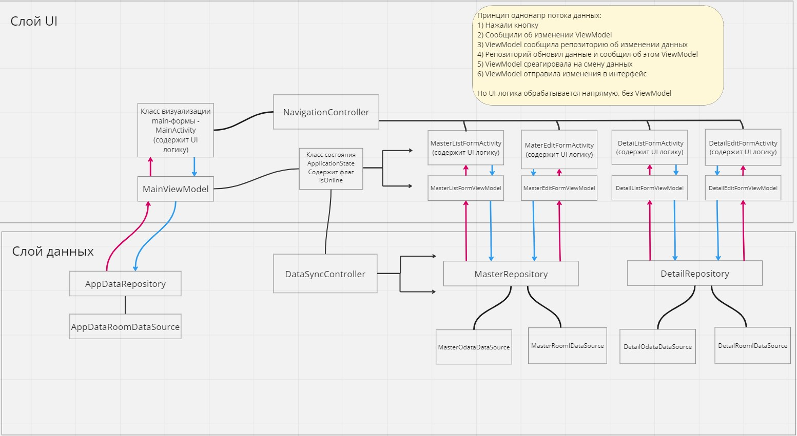

# Архитектура приложения

AndroidODataOfflineSample это native Android приложение, разработанное в соответствии с гайдами и рекомендациями от google.

Приложение обеспечивает работу с данными, используя два изолированных источника - оффлайн и онлайн БД. 
Переключение между источниками данных происходит по нажатию кнопки. Работая в оффлайн-режиме, пользователю доступно только чтение данных. При переходе в оффлайн режим, данные из онлайн БД полностью переходят в оффлайн БД.

## Проект. Основные сведения

**Gradle version** - 8.0

**minSdk** - 24

**targetSdk** - 33

Разрабатывался в Android Studio Flamingo 2022.2.1

## Функции и интерфейс приложения

Приложение работает с двумя тестовыми сущностями - Master и Detail. У каждой сущности есть List и Edit формы.
Можно удалять, менять и создавать объекты. С главного экрана доступен переход на списки Detail и Master, а также переключение режимов offline/online

## Схема Архитектуры

В приложении идет разделение логики на два слоя - слой данных и слой пользовательского интерфейса.

## Слой UI

Слой отвечает за отрисовку интерфейса и логику его работы - нажатие кнопок, навигация между формами, отображение данных.

Основные классы

**Activity** - отвечают за отрисовку интерфейса

**ViewModel** - работа с данными формы и логика интерфейса (например действия при нажатии кнопки)

**Screen** - Composable классы, которые отвечают за визуальную часть. в них описано, как будет выглядеть интерфейс. Описание идет в коде, с использованием инсрумента Jetpack Compose.
 
**NavigationController** - объединяет в себе несколько классов, реализующих навигацию между формами с использованием Jetpack Compose.

**ApplicationState** - Класс, хранящий состяния приложения. В рамках данного примера состояние это режим работы - offline/online. Класс используется во ViewModel и Screen классах. В зависимости от флага isOnline, ViewModel решают с каким типом данных работать, а классы интерфейса Screen реализуют интерфейсную логику (например установить readonly для Edit полей)

**SynchronizationService** - сервис синхронизации. Отслеживает состояние isOnline и при переходе в оффлайн режим, используя репозитории, передает все данные удаленной БД в локальную.

## Слой Data

Слой отвечает за работу с данными. В нем содержатся классы датасоурсов, репозиториев и моделей объектов. Приложение работает с двумя источниками данных.
В качестве offline БД используется Room - БД, работающая на основе SQLite.
Онлайн режим работает по протоколу Odata, а бэкендом выступает http://stands-backend.flexberry.net/odata

Основные классы

**Repository** - предоставляет формам методы работы с данными. Его задача скрыть для форм конкретную реализацию типа источника данных. Например, вызывая метод getObjectsOnline форма не задумывается о том, какой именно тип БД используется, репозиторий вернет форме модель стандартного вида. 

**DataSource** - классы нужны для работы с конкретным источником данных.

****

Для каждого объекта в Data слое описываются модели. Модель описывается для каждого DataSource отдельно, т.к разные типы БД могут иметь свои тонкости. Также описываются базовые модели, с которыми будут работать формы и части логики, которые не должны ничего знать о специфике работы источников данных.

## UI темы

Используя JetpackCompose и следую рекомендациям MaterialDesign, описание основных визуальных параметров UI храниться в специальных классах (ui/theme). В них задаются используемые в приложении цвета и параметры отрисовки элементов.
Также, если везде в интерфейсе используется какой-то единообразный элемент, например кнопка удаления, добавление и т.д, его нужно описать в theme.

## Внедрение зависимостей

Для внедрения зависимостей используется Hilt. В простом виде, экземпляры классов инжектятся с помощью специальный аннотаций Hilt. В случае, когда нужно предварительно сформировать экземпляры для внедрения, используются классы @Module. В данном проекте классы-модули с регситарциями располагаются в папках(пакетах) di.

